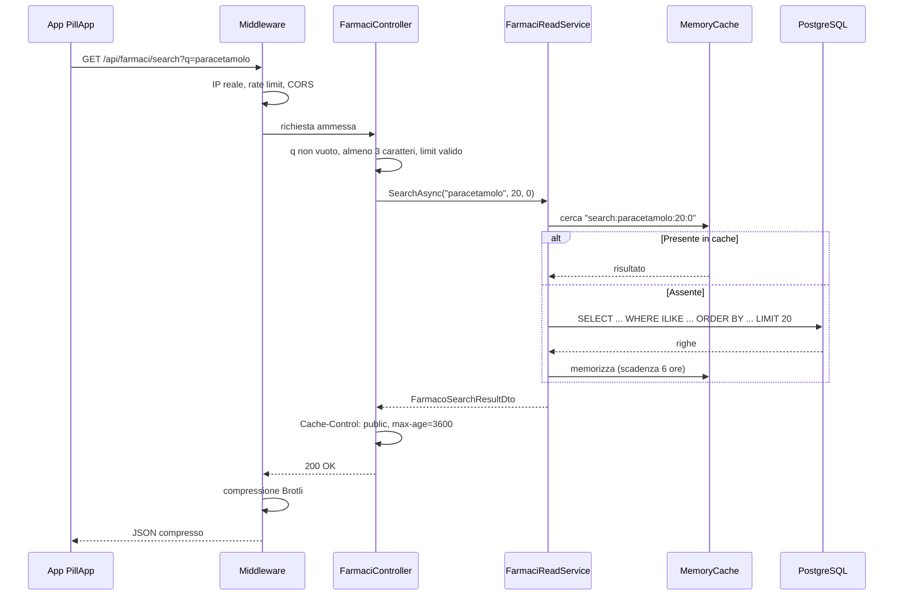
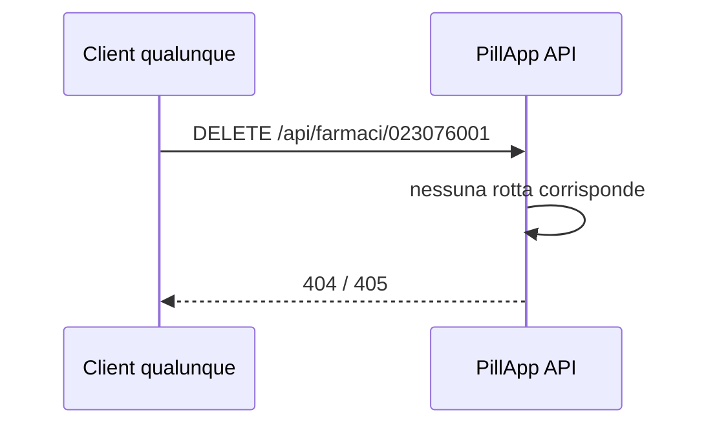
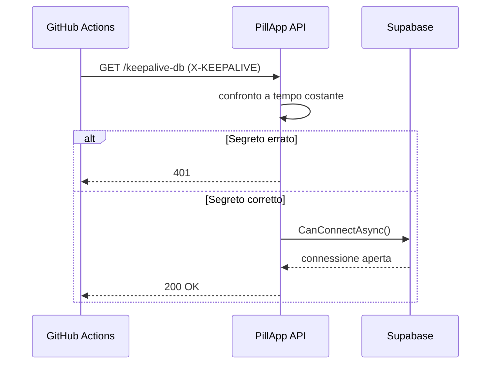

# Guida Studio Completa — PillApp Backend

> **Documento per lo studio locale del progetto.**
> Scritto per chi parte da zero: spiega cos'è, come funziona, a cosa serve ogni pezzo e come farlo girare.

---

## Indice

1. [Cos'è questo progetto?](#1-cosè-questo-progetto)
2. [Concetti base da conoscere prima](#2-concetti-base-da-conoscere-prima)
3. [Panoramica dell'architettura](#3-panoramica-dellarchitettura)
4. [Struttura delle cartelle](#4-struttura-delle-cartelle)
5. [Stack tecnologico](#5-stack-tecnologico)
6. [Il cuore dell'app: Program.cs](#6-il-cuore-dellapp-programcs)
7. [Il controller: FarmaciController](#7-il-controller-farmacicontroller)
8. [Il servizio di lettura e la cache](#8-il-servizio-di-lettura-e-la-cache)
9. [La ricerca testuale](#9-la-ricerca-testuale)
10. [Il database e Entity Framework](#10-il-database-e-entity-framework)
11. [Gli indici del database](#11-gli-indici-del-database)
12. [DTO e mapper](#12-dto-e-mapper)
13. [La gestione degli errori](#13-la-gestione-degli-errori)
14. [Sicurezza: tutte le protezioni](#14-sicurezza-tutte-le-protezioni)
15. [Configurazione e variabili d'ambiente](#15-configurazione-e-variabili-dambiente)
16. [Come far girare il progetto in locale](#16-come-far-girare-il-progetto-in-locale)
17. [Come testare le API](#17-come-testare-le-api)
18. [I test automatici](#18-i-test-automatici)
19. [Docker: cos'è e come funziona qui](#19-docker-cosè-e-come-funziona-qui)
20. [Deploy su Render](#20-deploy-su-render)
21. [GitHub Actions: CI e keepalive](#21-github-actions-ci-e-keepalive)
22. [Flussi completi](#22-flussi-completi)
23. [Glossario](#23-glossario)
24. [Percorso di studio consigliato](#24-percorso-di-studio-consigliato)
25. [Scelte di progetto e possibili evoluzioni](#25-scelte-di-progetto-e-possibili-evoluzioni)

---

## 1. Cos'è questo progetto?

**PillApp Backend** è il **server** (la parte "dietro le quinte") dell'app PillApp.

L'app mobile ha bisogno di un server a cui chiedere informazioni sui **farmaci di classe A**, quelli rimborsati dal Servizio Sanitario Nazionale italiano. Questo backend fa tre cose:

- **cerca farmaci** per principio attivo, nome della confezione o descrizione del gruppo
- **restituisce il dettaglio** di un farmaco a partire dal suo codice AIC
- **si tiene in vita**, impedendo a Supabase di sospendere il database e a Render di spegnere il servizio

È un'**API REST** scritta in **C# / ASP.NET Core** che legge da un database **PostgreSQL** (ospitato su **Supabase**) e risponde in **JSON**.

```
┌──────────────────┐         HTTP/JSON          ┌─────────────────────┐
│  App PillApp     │  ──────────────────────►   │  PillApp Backend    │
│  (React Native)  │  ◄──────────────────────   │  (questo progetto)  │
└──────────────────┘                            └──────────┬──────────┘
                                                           │
                                                           │ SQL
                                                           ▼
                                                ┌─────────────────────┐
                                                │  PostgreSQL         │
                                                │  (Supabase)         │
                                                │  farmaci_classe_a   │
                                                └─────────────────────┘
```

### Un punto importante: l'API è di sola lettura

Il frontend fa **solo richieste GET**. Il catalogo dei farmaci viene caricato e aggiornato direttamente su Supabase (import dei file AIFA, SQL Editor), non attraverso l'API.

Da questo deriva la caratteristica più importante del progetto: **non esistono endpoint di scrittura**. Non si può creare, modificare o cancellare un farmaco passando dall'API. E siccome non c'è niente da proteggere, **non esiste autenticazione**: nessun login, nessun token JWT, nessuna password da configurare.

Questa scelta va capita bene, perché è una decisione di progetto e non una mancanza. Ogni endpoint che non esiste è un endpoint che non può essere abusato, non va testato e non va mantenuto.

---

## 2. Concetti base da conoscere prima

### API REST

Un modo standard per far comunicare un'app con un server tramite **HTTP**. Ogni azione è un **endpoint** (un URL) associato a un **metodo**.

| Metodo | Significato tipico | Usato in questo progetto? |
|--------|-------------------|---------------------------|
| `GET` | Leggere dati | Sì, è l'unico usato |
| `POST` | Creare dati | No |
| `PUT` | Modificare dati | No |
| `DELETE` | Cancellare dati | No |

### JSON

Formato testuale per scambiare dati. Esempio di risposta:

```json
{
  "aic": "023076010",
  "principioAttivo": "Paracetamolo",
  "denominazioneConfezione": "Tachipirina 500mg compresse",
  "prezzoPubblico": 5.50
}
```

### AIC (Autorizzazione all'Immissione in Commercio)

Codice numerico univoco di un farmaco in Italia, di norma 9 cifre. È la "targa" del farmaco nel database e la chiave con cui il frontend chiede il dettaglio.

### Entity Framework Core (EF Core)

Libreria .NET che permette di interrogare il database usando oggetti e metodi C# invece di scrivere SQL a mano. EF Core traduce il codice C# in SQL.

### DTO (Data Transfer Object)

Oggetto usato solo per trasportare dati verso l'esterno. È separato dall'entità del database, così l'API non espone colonne interne (come `id`, `created_at`, `updated_at`).

### Middleware

Pezzi di codice che ogni richiesta HTTP attraversa **prima** di arrivare al controller, in ordine: compressione, header di sicurezza, rate limiting, CORS. Ognuno può leggere, modificare o interrompere la richiesta.

### CORS (Cross-Origin Resource Sharing)

Regola di sicurezza dei **browser**: dice quali siti possono chiamare l'API. Un'app React Native nativa non è un browser, quindi il CORS non la riguarda. Serve solo se usi Expo Web o un'anteprima nel browser.

### Cache

Copia temporanea di un risultato già calcolato. Se dieci utenti cercano "paracetamolo", il database viene interrogato una volta sola e le altre nove risposte arrivano dalla memoria.

### Supabase

Servizio cloud che offre PostgreSQL gestito. Il piano gratuito **sospende il progetto** dopo 7 giorni senza attività: da qui il meccanismo di **keepalive**.

### Render

Servizio di hosting dove gira il backend. Il piano gratuito **spegne il servizio** dopo circa 15 minuti di inattività, e la richiesta successiva deve attendere la riaccensione (il cosiddetto *cold start*).

---

## 3. Panoramica dell'architettura

```
Richiesta HTTP
      │
      ▼
┌──────────────────────────────────────────────────┐
│  PIPELINE MIDDLEWARE (Program.cs)                │
│  ExceptionHandler → ForwardedHeaders             │
│  → ResponseCompression → HSTS/Swagger            │
│  → Security headers → RateLimiter → CORS         │
└─────────────────┬────────────────────────────────┘
                  │
        ┌─────────┴──────────┐
        ▼                    ▼
  Minimal APIs          FarmaciController
  (/, /health,          (validazione input)
   /keepalive-db)             │
        │                     ▼
        │            FarmaciReadService
        │             (query + cache)
        │                     │
        └─────────┬───────────┘
                  ▼
           AppDbContext (EF Core)
                  │
                  ▼
           PostgreSQL (Supabase)
```

### Perché il controller non parla direttamente al database

Il controller ha un compito solo: **validare l'input e tradurre il risultato in una risposta HTTP**. Tutto ciò che riguarda i dati, cioè la query e la cache, sta in `FarmaciReadService`.

Questa separazione serve a due cose. Primo, il controller resta leggibile: guardandolo capisci subito quali sono le regole di validazione. Secondo, il service è testabile da solo, senza costruire un contesto HTTP finto.

### Pattern usati

- **Minimal hosting model** — tutta la configurazione in `Program.cs`, senza `Startup.cs`
- **Thin controller** — solo validazione e forma della risposta
- **Service di lettura** — un unico punto dove passa l'accesso ai dati
- **DTO con proiezione** — le query selezionano solo le colonne che finiscono nel JSON
- **Fail-fast startup** — l'app non parte se manca una configurazione critica

### Pattern deliberatamente non usati

- **Repository pattern**: `AppDbContext` è già un'astrazione sul database, aggiungerne un'altra sopra non darebbe nulla in cambio
- **CQRS / MediatR**: due endpoint di lettura non giustificano quell'infrastruttura
- **Migrations EF Core**: lo schema del database è gestito su Supabase, l'app lo legge senza pretendere di crearlo

---

## 4. Struttura delle cartelle

```
PillApp_BackEnd/
│
├── GUIDA_STUDIO.md              ← Questo documento
├── README.md                    ← Documentazione tecnica
├── RENDER.md                    ← Istruzioni deploy Render
├── PillApp.slnx                 ← Solution: raggruppa i due progetti
├── Directory.Packages.props     ← Versioni NuGet centralizzate
├── Dockerfile                   ← Ricetta per il container
├── render.yaml                  ← Blueprint deploy Render
├── .dockerignore                ← File esclusi dalla build Docker
├── .gitignore                   ← File esclusi da Git
│
├── .github/workflows/
│   ├── build-test.yml           ← CI: build e test su ogni push e PR
│   └── keepalive.yml            ← Cron: ping periodico al database
│
├── scripts/
│   └── create-search-indexes.sql ← Indici da creare su Supabase
│
└── PillAppBackend/
    │
    ├── PillApp.Api/                     ← PROGETTO PRINCIPALE
    │   ├── Program.cs                   ← Entry point, middleware, endpoint minimali
    │   ├── PillApp.Api.csproj           ← Pacchetti NuGet (senza numeri di versione)
    │   ├── PillApp.Api.http             ← Richieste pronte da eseguire
    │   ├── appsettings.json             ← Config base (valori vuoti, sicura per Git)
    │   ├── appsettings.Development.json ← Config locale
    │   ├── Controllers/
    │   │   └── FarmaciController.cs     ← Le due rotte pubbliche
    │   ├── Services/
    │   │   └── FarmaciReadService.cs    ← Query di lettura e cache
    │   ├── Helpers/
    │   │   ├── FarmacoSearchQuery.cs    ← Costruzione della ricerca testuale
    │   │   └── FarmacoDtoMapper.cs      ← Proiezione entità → DTO
    │   ├── Infrastructure/
    │   │   └── GlobalExceptionHandler.cs ← Errori non gestiti
    │   ├── Data/
    │   │   └── AppDbContext.cs          ← Il "ponte" verso il database
    │   ├── Models/
    │   │   └── FarmacoClasseA.cs        ← Entità mappata sulla tabella
    │   └── Dtos/
    │       ├── FarmacoLookupDto.cs      ← Il farmaco come lo vede il client
    │       └── FarmacoSearchResultDto.cs ← Risultato paginato
    │
    └── PillApp.Api.Tests/                    ← PROGETTO DI TEST
        ├── FarmaciControllerTests.cs         ← Test unitari
        ├── ApiIntegrationTests.cs            ← Test end-to-end
        └── PillAppWebApplicationFactory.cs   ← Avvia l'app in memoria per i test
```

### Cosa sono `PillApp.slnx` e `Directory.Packages.props`

Sono due file di infrastruttura che vale la pena capire, perché in molti tutorial non compaiono.

**`PillApp.slnx`** è la *solution*: un file che dice "questi due progetti fanno parte della stessa cosa". Serve per aprire tutto insieme nell'IDE e per lanciare un solo comando su entrambi (`dotnet test PillApp.slnx`). Il formato `.slnx` è la versione XML moderna del vecchio `.sln`.

**`Directory.Packages.props`** raccoglie in un unico posto le versioni di tutti i pacchetti NuGet. Nei `.csproj` i pacchetti sono elencati **senza numero di versione**:

```xml
<PackageReference Include="Microsoft.EntityFrameworkCore" />
```

Il vantaggio è che due progetti non possono più usare versioni diverse della stessa libreria. Prima di questa centralizzazione il progetto API usava EF Core 10.0.8 e quello di test 10.0.9: un disallineamento silenzioso che poteva far comportare i test in modo diverso dalla produzione.

---

## 5. Stack tecnologico

| Tecnologia | Versione | A cosa serve |
|-----------|----------|--------------|
| .NET | 10.0 | Piattaforma di esecuzione |
| ASP.NET Core | 10.0 | Framework web |
| Entity Framework Core | 10.0.9 | Accesso al database |
| Npgsql | 10.0.1 | Driver PostgreSQL per EF Core |
| Swashbuckle (Swagger) | 10.2.1 | Documentazione interattiva delle API |
| xUnit | 2.9.3 | Framework di test |
| PostgreSQL | — | Database (su Supabase) |
| Docker | — | Containerizzazione per il deploy |

### Pacchetti che non ci sono (e perché è importante)

Il progetto ha avuto in passato `Microsoft.AspNetCore.Authentication.JwtBearer` e `BCrypt.Net-Next`: sono stati rimossi insieme all'autenticazione.

Aveva anche `Microsoft.EntityFrameworkCore.InMemory`, un provider di database finto usato **soltanto dai test**, che però era dichiarato nel progetto API e finiva quindi dentro il binario di produzione. Ora sta solo nel progetto di test, dove è il suo posto.

Infine c'era `Microsoft.EntityFrameworkCore.Design`, che serve a generare le *migrations*: siccome questo progetto non ne usa nessuna, era peso morto.

La lezione generale: ogni pacchetto in un `.csproj` è codice di terze parti che viene distribuito con l'applicazione, va aggiornato e può avere vulnerabilità. Meno pacchetti, meno superficie.

---

## 6. Il cuore dell'app: Program.cs

`Program.cs` fa due cose, in questo ordine: prima **registra i servizi** (cosa l'app sa fare), poi **costruisce la pipeline** (cosa succede a ogni richiesta).

### Fase 1: validazione della configurazione

```csharp
var connectionString = builder.Configuration.GetConnectionString("SupabaseDb");
var keepaliveSecret = builder.Configuration["Security:KeepaliveSecret"];

if (string.IsNullOrWhiteSpace(connectionString))
{
    throw new InvalidOperationException(
        "Missing database configuration. Set ConnectionStrings__SupabaseDb.");
}

if (!builder.Environment.IsDevelopment() && string.IsNullOrWhiteSpace(keepaliveSecret))
{
    throw new InvalidOperationException(
        "Missing keepalive configuration. Set Security__KeepaliveSecret in non-development environments.");
}
```

Questo si chiama **fail-fast**: se manca una configurazione essenziale, l'app **non parte**. Sembra brutale, ma è la scelta giusta. L'alternativa sarebbe un servizio che parte, risponde ai controlli di salute, sembra funzionante, e poi restituisce errori a ogni richiesta reale. Un crash all'avvio si vede subito nei log del deploy; un servizio silenziosamente rotto lo scopri dagli utenti.

Nota il doppio underscore: `Security__KeepaliveSecret` come variabile d'ambiente corrisponde a `Security:KeepaliveSecret` nel file JSON. È la convenzione di .NET, perché i due punti non sono validi nei nomi di variabile d'ambiente su tutti i sistemi.

### Fase 2: registrazione dei servizi

```csharp
builder.Services.AddControllers();
builder.Services.AddEndpointsApiExplorer();
builder.Services.AddSwaggerGen();
builder.Services.AddProblemDetails();
builder.Services.AddExceptionHandler<GlobalExceptionHandler>();

builder.Services.AddMemoryCache(options => options.SizeLimit = 512);
builder.Services.AddScoped<FarmaciReadService>();
```

`AddMemoryCache` con `SizeLimit = 512` merita una spiegazione. Senza limite, un attaccante (o un bug nel client) potrebbe inviare migliaia di termini di ricerca diversi: ognuno produrrebbe una voce in cache, e la memoria crescerebbe fino a far uccidere il processo. Con il limite, quando si raggiungono 512 voci le più vecchie vengono buttate via.

`AddScoped` significa che viene creata **una istanza per richiesta HTTP**. È lo stesso ciclo di vita del `DbContext`, che il service usa, e questo è il motivo della scelta: un `DbContext` non è sicuro da condividere tra richieste parallele.

### Fase 3: compressione

```csharp
builder.Services.AddResponseCompression(options =>
{
    options.EnableForHttps = true;
    options.Providers.Add<BrotliCompressionProvider>();
    options.Providers.Add<GzipCompressionProvider>();
});
```

Una pagina di venti farmaci in JSON contiene molto testo ripetitivo (i nomi dei campi si ripetono per ogni elemento) e si comprime del 70-80%. Su rete mobile è la differenza più percepibile dall'utente.

`EnableForHttps = true` va usato con consapevolezza: comprimere risposte cifrate può, in certe condizioni, aiutare un attaccante a indovinare dati segreti presenti nella risposta (è la classe di attacchi BREACH). Qui è sicuro perché le risposte contengono solo dati pubblici del catalogo farmaci: non ci sono token, cookie di sessione o dati personali.

`Level = CompressionLevel.Fastest` privilegia la velocità sul rapporto di compressione: su Render il piano gratuito ha poca CPU, e la differenza di dimensione tra il livello massimo e quello più veloce è marginale rispetto al costo in tempo.

### Fase 4: CORS

```csharp
options.AddPolicy("ConfiguredOrigins", policy =>
{
    if (builder.Environment.IsDevelopment())
    {
        policy.AllowAnyOrigin().AllowAnyHeader().AllowAnyMethod();
        return;
    }

    var allowedOrigins = builder.Configuration
        .GetSection("Cors:AllowedOrigins")
        .Get<string[]>() ?? [];

    if (allowedOrigins.Length > 0)
    {
        policy.WithOrigins(allowedOrigins)
              .AllowAnyHeader()
              .WithMethods("GET");
    }
});
```

In sviluppo tutto è permesso, per non litigare con emulatori e anteprime web. In produzione solo le origini configurate, e solo il metodo `GET`: se un domani venisse aggiunto per errore un endpoint di scrittura, un browser non riuscirebbe comunque a chiamarlo da un'altra origine.

### Fase 5: rate limiting

```csharp
var permitPerMinute = builder.Configuration.GetValue<int?>("RateLimiting:PermitPerMinute") ?? 300;

options.GlobalLimiter = PartitionedRateLimiter.Create<HttpContext, string>(httpContext =>
{
    var partitionKey = httpContext.Connection.RemoteIpAddress?.ToString() ?? "unknown";

    return RateLimitPartition.GetFixedWindowLimiter(partitionKey, _ => new FixedWindowRateLimiterOptions
    {
        PermitLimit = permitPerMinute,
        Window = TimeSpan.FromMinutes(1),
        QueueLimit = 0,
        AutoReplenishment = true
    });
});
```

Ogni indirizzo IP ha il proprio contatore (`PartitionedRateLimiter` significa esattamente questo: un limitatore separato per ogni chiave). Superate 300 richieste in un minuto, l'API risponde `429 Too Many Requests` con l'header `Retry-After`.

Perché 300 e non un numero più basso? Una barra di ricerca che invia una richiesta a ogni carattere digitato genera molto traffico legittimo. Un limite troppo stretto colpirebbe gli utenti reali prima degli abusi. E la cache rende comunque quelle richieste economiche per il database.

`QueueLimit = 0` significa che le richieste in eccesso vengono rifiutate immediatamente invece di essere messe in attesa: meglio un errore rapido e chiaro che una richiesta appesa.

### Fase 6: header inoltrati (forwarded headers)

```csharp
builder.Services.Configure<ForwardedHeadersOptions>(options =>
{
    options.ForwardedHeaders = ForwardedHeaders.XForwardedFor | ForwardedHeaders.XForwardedProto;
    options.ForwardLimit = 1;
    options.KnownIPNetworks.Clear();
    options.KnownProxies.Clear();
});
```

Questa è la parte più sottile di tutto `Program.cs`, e va capita perché da essa dipende il funzionamento del rate limiting.

Su Render l'applicazione non riceve le richieste direttamente: davanti c'è un **proxy**. Dal punto di vista dell'app, tutte le richieste arrivano dall'indirizzo del proxy. Se il rate limiting partizionasse su quell'indirizzo, tutti gli utenti del mondo condividerebbero un unico contatore.

La soluzione è l'header `X-Forwarded-For`, in cui il proxy scrive l'IP reale del client. `UseForwardedHeaders` legge quell'header e aggiorna `Connection.RemoteIpAddress`, così il rate limiting vede l'IP vero.

Il rischio è evidente: se l'app si fida di un header inviato dall'esterno, un client può scriverci un IP falso, cambiarlo a ogni richiesta e non essere mai limitato. Qui entra in gioco `ForwardLimit = 1`, che dice a ASP.NET di leggere **solo l'ultimo valore** della lista. Quando un client invia `X-Forwarded-For: 1.2.3.4`, il proxy di Render *aggiunge* il vero IP alla fine: `1.2.3.4, 93.45.x.x`. Leggendo l'ultimo, si ottiene sempre il valore scritto dal proxy, non quello scelto dal client.

`KnownProxies.Clear()` è necessario perché l'indirizzo del proxy di Render non è noto in anticipo e può cambiare; senza svuotare quella lista, ASP.NET ignorerebbe l'header. Il valore 1 è anche il default di `ForwardLimit`, ma è scritto esplicitamente perché la sicurezza del rate limiting dipende da esso: un default silenzioso è troppo facile da rompere senza accorgersene.

### Fase 7: la pipeline

L'**ordine** dei middleware è significativo: ogni richiesta li attraversa dall'alto verso il basso.

```csharp
app.UseExceptionHandler();      // per primo: deve poter catturare gli errori di tutti gli altri
app.UseForwardedHeaders();      // presto: gli altri middleware devono vedere l'IP corretto
app.UseResponseCompression();

if (app.Environment.IsDevelopment()) { app.UseSwagger(); app.UseSwaggerUI(); }
else { app.UseHsts(); }

app.Use(/* header di sicurezza */);
app.UseRateLimiter();
app.UseCors("ConfiguredOrigins");
app.MapControllers();
```

Due punti da notare. `UseExceptionHandler` è per primo perché un middleware può gestire solo le eccezioni di quelli che vengono dopo di lui. E `UseForwardedHeaders` viene prima di `UseRateLimiter` proprio perché quest'ultimo ha bisogno dell'IP già corretto.

### Fase 8: gli endpoint minimali

Tre endpoint sono definiti direttamente in `Program.cs`, senza controller, perché sono troppo semplici per giustificarne uno.

`GET /` restituisce l'elenco degli endpoint pubblici: utile per verificare a occhio che il servizio sia quello giusto.

`GET /health` dice solo che l'applicazione è viva. **Non interroga il database**, e questa è una scelta precisa: Render usa questo endpoint per decidere se il servizio è sano, e se restituisse errore quando Supabase è temporaneamente irraggiungibile, Render riavvierebbe il container in continuazione peggiorando la situazione.

`GET /keepalive-db` è l'unico endpoint protetto:

```csharp
if (!request.Headers.TryGetValue("X-KEEPALIVE", out var incomingSecret) ||
    !FixedTimeEquals(keepaliveSecret, incomingSecret.ToString()))
{
    return Results.Unauthorized();
}
```

Il confronto usa `FixedTimeEquals`, che impiega **sempre lo stesso tempo** indipendentemente da quanti caratteri iniziali coincidono. Un normale `==` su stringhe si ferma al primo carattere diverso, e misurando i tempi di risposta un attaccante potrebbe indovinare il segreto un carattere alla volta. Si chiama *timing attack*, ed è economico difendersi.

---

## 7. Il controller: FarmaciController

Il controller espone due rotte, entrambe pubbliche e in sola lettura.

| Metodo | Rotta | Cosa fa |
|--------|-------|---------|
| `GET` | `/api/farmaci/search?q=&limit=&offset=` | Ricerca paginata |
| `GET` | `/api/farmaci/{aic}` | Dettaglio per codice AIC |

### Gli attributi in cima alla classe

```csharp
[ApiController]
[Route("api/[controller]")]
public class FarmaciController : ControllerBase
```

`[ApiController]` attiva i comportamenti automatici delle API: validazione del model, risposte di errore in formato standard, binding dei parametri. `[Route("api/[controller]")]` costruisce il percorso base dal nome della classe: `FarmaciController` diventa `api/farmaci`.

### La validazione della ricerca

```csharp
if (string.IsNullOrWhiteSpace(q))
    return BadRequest(new { error = "Il termine di ricerca è obbligatorio." });

if (q.Trim().Length < MinSearchLength)
    return BadRequest(new { error = $"Il termine di ricerca deve contenere almeno {MinSearchLength} caratteri." });

if (limit < 1 || limit > MaxLimit)
    return BadRequest(new { error = $"Il parametro limit deve essere compreso tra 1 e {MaxLimit}." });

if (offset < 0)
    return BadRequest(new { error = "Il parametro offset deve essere maggiore o uguale a zero." });
```

Il **minimo di tre caratteri** non è una scelta arbitraria e non serve a "pulire" l'input: è una protezione del database. La ricerca usa indici *trigram*, che funzionano spezzando il testo in gruppi di tre caratteri. Con un termine di uno o due caratteri l'indice non è utilizzabile e PostgreSQL ripiega su una scansione completa della tabella. Su decine di migliaia di righe, con il piano gratuito di Supabase, è una richiesta che può bloccare il database per tutti.

Il **massimo di 100 elementi** per pagina impedisce a un client di chiedere l'intero catalogo in una sola risposta.

### L'header di cache

```csharp
private void SetClientCacheHeader() =>
    Response.Headers.CacheControl = $"public, max-age={ClientCacheSeconds}";
```

Con questo header l'API dice al client: "puoi riutilizzare questa risposta per un'ora senza richiedermela". È un secondo livello di cache, dopo quello in memoria del server, e agisce dove è più efficace: sul dispositivo dell'utente, dove risparmia anche il viaggio di rete.

`public` significa che anche eventuali proxy intermedi possono conservare la risposta. È corretto qui perché i dati sono identici per tutti gli utenti; sarebbe un errore grave su dati personali.

---

## 8. Il servizio di lettura e la cache

`FarmaciReadService` è il punto in cui passano tutte le letture dal database.

### La chiave di cache

```csharp
var term = q.Trim();
var cacheKey = $"search:{term.ToLowerInvariant()}:{limit}:{offset}";

if (_cache.TryGetValue(cacheKey, out FarmacoSearchResultDto? cached) && cached is not null)
    return cached;
```

La chiave include il termine **normalizzato** (senza spazi ai bordi, tutto minuscolo) più i parametri di paginazione. La normalizzazione fa sì che `"Paracetamolo"`, `"paracetamolo"` e `" paracetamolo "` condividano la stessa voce di cache invece di occuparne tre.

I parametri `limit` e `offset` devono far parte della chiave perché pagine diverse sono risultati diversi: senza di essi la seconda pagina restituirebbe il contenuto della prima.

### Il prefisso nella chiave

Le chiavi di ricerca iniziano con `search:` e quelle di lookup con `aic:`. Serve a evitare collisioni: se un giorno qualcuno cercasse il testo `023076001`, la sua chiave sarebbe `search:023076001:20:0` e non si sovrapporrebbe a `aic:023076001`, che contiene un tipo di dato completamente diverso.

### La query

```csharp
var query = FarmacoSearchQuery.Apply(
    _db.FarmaciClasseA.AsNoTracking(),
    term,
    useILike: _db.Database.IsNpgsql());

var total = await query.CountAsync(cancellationToken);

var items = await query
    .OrderBy(f => f.DenominazioneConfezione)
    .ThenBy(f => f.Aic)
    .Skip(offset)
    .Take(limit)
    .Select(FarmacoDtoMapper.ToLookupDto)
    .ToListAsync(cancellationToken);
```

Ci sono quattro dettagli importanti in poche righe.

**`AsNoTracking()`** dice a EF Core di non tenere traccia degli oggetti caricati. Il *change tracking* serve solo quando si vogliono salvare modifiche: in un'API di sola lettura è lavoro e memoria sprecati.

**`Select(FarmacoDtoMapper.ToLookupDto)`** applica la proiezione *dentro* la query, non dopo. La differenza è sostanziale: EF Core genera un `SELECT` con le sole dieci colonne che servono, invece di leggere tutte le colonne della tabella e scartarne una parte in memoria. Meno dati letti dal disco e meno traffico di rete verso Supabase.

**`ThenBy(f => f.Aic)`** risolve un bug tutt'altro che ovvio. La colonna `denominazione_confezione` **non è univoca**: nei dati AIFA esistono confezioni con lo stesso nome. Ordinando solo per quella colonna, PostgreSQL è libero di restituire due righe omonime in ordine diverso a ogni esecuzione. Il risultato, per l'utente che scorre l'elenco, è vedere lo stesso farmaco due volte oppure non vederne uno affatto. Aggiungere un secondo criterio univoco rende l'ordinamento **deterministico** e la paginazione affidabile. Nella suite di test c'è un caso dedicato a questo.

**`_db.Database.IsNpgsql()`** merita il paragrafo che segue.

### Come i test non "inquinano" il codice di produzione

I test girano su un database finto in memoria, che non supporta l'operatore `ILIKE` di PostgreSQL. Serve quindi un modo per scegliere la strategia di ricerca.

La versione precedente del progetto risolveva così: il controller riceveva `IWebHostEnvironment` e controllava `IsEnvironment("Testing")`. Funzionava, ma significava che il **codice di produzione conteneva un ramo dedicato ai test**. È un difetto di progettazione, per due motivi: aggiunge una dipendenza che non ha nulla a che fare con il compito del controller, e crea un percorso di codice che in produzione non viene mai eseguito.

Ora la decisione si basa su `IsNpgsql()`, cioè su una **capacità del provider di database** invece che sul nome di un ambiente. È una distinzione legittima anche fuori dai test: se domani l'app girasse su un altro database, la logica resterebbe corretta senza modifiche. Il codice non sa più di essere sotto test, ed è il progetto di test a sostituire il provider (vedi la sezione 18).

### La scadenza della cache

```csharp
private void Cache<T>(string key, T value) =>
    _cache.Set(key, value, new MemoryCacheEntryOptions
    {
        AbsoluteExpirationRelativeToNow = _cacheTtl,
        Size = 1
    });
```

`_cacheTtl` vale sei ore per default e si configura con `Cache__TtlMinutes`. Il valore è tarato sul fatto che il catalogo AIFA cambia circa una volta al mese: sei ore di dati potenzialmente vecchi sono irrilevanti in quel contesto.

Il rovescio della medaglia va conosciuto: **dopo un aggiornamento del catalogo su Supabase, l'API può servire dati vecchi fino a sei ore**. Per forzare l'aggiornamento basta riavviare il servizio su Render, dato che la cache vive nella memoria del processo.

`Size = 1` collabora con il `SizeLimit = 512` impostato in `Program.cs`: ogni voce "pesa" uno, quindi il limite corrisponde a 512 risultati conservati.

Nota infine che anche i **risultati vuoti vengono messi in cache**: se un codice AIC non esiste, la risposta `null` viene conservata. Senza questo, richieste ripetute su codici inesistenti passerebbero sempre dal database.

---

## 9. La ricerca testuale

```csharp
public static IQueryable<FarmacoClasseA> Apply(IQueryable<FarmacoClasseA> query, string q, bool useILike)
{
    if (useILike)
    {
        var pattern = $"%{q}%";
        return query.Where(f =>
            (f.PrincipioAttivo != null && EF.Functions.ILike(f.PrincipioAttivo, pattern)) ||
            EF.Functions.ILike(f.DenominazioneConfezione, pattern) ||
            (f.DescrizioneGruppo != null && EF.Functions.ILike(f.DescrizioneGruppo, pattern)));
    }

    var term = q.Trim().ToLowerInvariant();
    return query.Where(f =>
        (f.PrincipioAttivo != null && f.PrincipioAttivo.ToLower().Contains(term)) ||
        f.DenominazioneConfezione.ToLower().Contains(term) ||
        (f.DescrizioneGruppo != null && f.DescrizioneGruppo.ToLower().Contains(term)));
}
```

La ricerca guarda in tre colonne: principio attivo, denominazione della confezione e descrizione del gruppo. Così chi cerca "paracetamolo" trova i farmaci per principio attivo, e chi cerca "tachipirina" li trova per nome commerciale.

`ILIKE` è la versione di `LIKE` che ignora maiuscole e minuscole, specifica di PostgreSQL. Il pattern `%termine%` cerca il testo in qualsiasi posizione, non solo all'inizio.

Il metodo restituisce un `IQueryable`, non una lista: **la query non è ancora stata eseguita**. È solo una descrizione, a cui il chiamante aggiunge ordinamento e paginazione prima che EF Core la traduca in un unico `SELECT`. Questo è il concetto di *deferred execution*, ed è la ragione per cui la ricerca non carica mai tutta la tabella in memoria.

Un limite noto di questa implementazione: il ramo per il database in memoria usa `ToLower().Contains()`, che non si comporta esattamente come `ILIKE` su accenti e regole di ordinamento locali. I test quindi non validano il *medesimo* comportamento della produzione. La soluzione corretta sarebbe far girare i test di integrazione su un vero PostgreSQL con Testcontainers.

---

## 10. Il database e Entity Framework

### L'entità

```csharp
[Table("farmaci_classe_a")]
public class FarmacoClasseA
{
    [Key]
    [Column("id")]
    public long Id { get; set; }

    [Column("principio_attivo")]
    public string? PrincipioAttivo { get; set; }

    [Required]
    [Column("denominazione_confezione")]
    public string DenominazioneConfezione { get; set; } = string.Empty;

    [Required]
    [Column("aic")]
    public string Aic { get; set; } = string.Empty;

    // ... altre colonne
}
```

Gli attributi `[Table]` e `[Column]` fanno la traduzione tra due convenzioni di nomi: PostgreSQL usa `snake_case` (parole separate da underscore), C# usa `PascalCase`. Senza questi attributi EF Core cercherebbe una colonna `PrincipioAttivo` e non la troverebbe.

Il punto di domanda in `string?` indica che la colonna può contenere `NULL`. È il *nullable reference types* di C#, attivo grazie a `<Nullable>enable</Nullable>` nel `.csproj`: il compilatore avverte se si usa un valore potenzialmente nullo senza controllarlo. Nel codice di ricerca infatti ogni campo nullable è protetto da un `!= null`.

### Il DbContext

```csharp
public class AppDbContext : DbContext
{
    public DbSet<FarmacoClasseA> FarmaciClasseA => Set<FarmacoClasseA>();

    protected override void OnModelCreating(ModelBuilder modelBuilder)
    {
        base.OnModelCreating(modelBuilder);

        modelBuilder.Entity<FarmacoClasseA>(entity =>
        {
            entity.HasKey(e => e.Id);
            entity.Property(e => e.Id).ValueGeneratedOnAdd();
            entity.HasIndex(e => e.Aic).IsUnique();
        });
    }
}
```

Il `DbContext` è il ponte verso il database: ogni `DbSet` corrisponde a una tabella su cui si possono scrivere query LINQ.

Attenzione a un punto che genera confusione: `HasIndex(...).IsUnique()` descrive a EF Core come *dovrebbe* essere fatto il database, ma **non crea nulla**. Senza migrations, gli indici vanno creati a mano su Supabase. È l'argomento della prossima sezione.

### Perché non ci sono migrations

Le *migrations* di EF Core sono script generati automaticamente per far evolvere lo schema del database seguendo il codice C#. Qui non ci sono, ed è coerente con il progetto: lo schema e i dati sono gestiti su Supabase, dove il catalogo AIFA viene importato. L'applicazione è un lettore, non il proprietario dello schema.

La conseguenza pratica è che se qualcuno cambia una colonna su Supabase senza aggiornare `FarmacoClasseA.cs`, l'errore si manifesta a runtime alla prima query. È il prezzo di questa scelta, ed è accettabile su una tabella che cambia forma raramente.

---

## 11. Gli indici del database

Questa sezione è breve ma è tra le più importanti: **senza gli indici giusti, il codice descritto finora funziona ma è lentissimo**.

Un indice è una struttura che permette al database di trovare le righe senza leggere l'intera tabella, come l'indice analitico di un libro. Il file `scripts/create-search-indexes.sql` contiene quello che serve, da eseguire nel SQL Editor di Supabase.

Il principio guida è che **un indice va giustificato da una query**. L'API esegue due sole query, quindi la lista degli indici utili è corta e tutto il resto è peso morto: occupa spazio (500 MB in totale sul piano gratuito) e va riscritto a ogni modifica dei dati.

### 1. L'indice su `aic`: quello che non va creato

`GET /api/farmaci/{aic}` ha bisogno di un indice su `aic`, altrimenti ogni lookup legge tutte le righe della tabella per trovarne una. Ma su questo database **non va creato nulla**, e il motivo è una regola di PostgreSQL che vale la pena conoscere.

Quando una colonna ha un vincolo `UNIQUE`, PostgreSQL crea automaticamente un indice per farlo rispettare: non ha altro modo di verificare l'unicità in modo efficiente a ogni inserimento. Quell'indice, che nella nostra tabella si chiama `farmaci_classe_a_aic_key`, è un indice a tutti gli effetti e il planner lo usa per le ricerche.

La conseguenza pratica: **un vincolo `UNIQUE` è già un indice**. Aggiungerne uno esplicito sulla stessa colonna crea un doppione che occupa spazio e va aggiornato a ogni scrittura, senza rendere nulla più veloce.

Il modo per accorgersene è elencare i vincoli della tabella:

```sql
SELECT conname, contype FROM pg_constraint
WHERE conrelid = 'farmaci_classe_a'::regclass;
```

Lo stesso vale per la chiave primaria: `farmaci_classe_a_pkey` è l'indice della `PRIMARY KEY` su `id`, e non va né creato né rimosso.

### 2. L'indice per l'ordinamento

```sql
CREATE INDEX IF NOT EXISTS idx_farmaci_classe_a_denominazione_ordinamento
    ON farmaci_classe_a (denominazione_confezione, aic);
```

Corrisponde esattamente all'`OrderBy(...).ThenBy(...)` della ricerca. Con un indice già ordinato su quelle due colonne, PostgreSQL non deve ordinare i risultati in memoria a ogni richiesta.

### 3. Gli indici trigram

```sql
CREATE EXTENSION IF NOT EXISTS pg_trgm;

CREATE INDEX IF NOT EXISTS idx_farmaci_classe_a_principio_attivo_trgm
    ON farmaci_classe_a USING gin (principio_attivo gin_trgm_ops);
```

Gli indici normali non aiutano una ricerca del tipo `ILIKE '%termine%'`, perché non sapendo come inizia il testo cercato non c'è un punto da cui partire. Gli indici **trigram** risolvono il problema spezzando ogni testo in sequenze di tre caratteri e indicizzando quelle: "paracetamolo" diventa `par`, `ara`, `rac`, `ace`, e così via.

Da qui viene il minimo di tre caratteri imposto dall'API: con meno di tre caratteri non c'è nessun trigramma da cercare e l'indice è inutilizzabile. La regola nel controller e la struttura dell'indice sono due facce della stessa decisione tecnica.

### 4. Riconoscere gli indici inutili

Gli indici si accumulano: vengono creati "per sicurezza", con nomi diversi in momenti diversi, e nessuno li rimuove più. Questa query mostra tutto quello che serve per decidere:

```sql
SELECT
    c.relname AS indice,
    pg_size_pretty(pg_relation_size(c.oid)) AS dimensione,
    s.idx_scan AS volte_usato,
    pg_get_indexdef(c.oid) AS definizione
FROM pg_class c
JOIN pg_index x ON x.indexrelid = c.oid
JOIN pg_class t ON t.oid = x.indrelid
LEFT JOIN pg_stat_user_indexes s ON s.indexrelid = c.oid
WHERE t.relname = 'farmaci_classe_a'
ORDER BY pg_relation_size(c.oid) DESC;
```

`idx_scan` conta quante volte il planner ha effettivamente scelto quell'indice. Va però letto con prudenza: uno zero può significare "inutile" oppure semplicemente "nessuna query di quel tipo è ancora passata". Su questo database gli indici trigram erano tutti a zero mentre l'indice su `aic` registrava 74 letture, e la spiegazione era che il frontend aveva fatto lookup ma non ancora ricerche testuali.

La prova definitiva è il **piano di esecuzione**, che dice cosa il database fa davvero:

```sql
EXPLAIN ANALYZE
SELECT aic, principio_attivo, denominazione_confezione
FROM farmaci_classe_a
WHERE principio_attivo ILIKE '%paracetamolo%'
   OR denominazione_confezione ILIKE '%paracetamolo%'
   OR descrizione_gruppo ILIKE '%paracetamolo%'
ORDER BY denominazione_confezione, aic
LIMIT 20;
```

Su questa tabella il piano mostra tre `Bitmap Index Scan`, uno per indice trigram, uniti da un `BitmapOr`, e conclude in circa 7 millisecondi leggendo cinque blocchi. Gli indici trigram servono, quindi.

Due cose interessanti nello stesso piano. L'ordinamento viene risolto con `Sort Method: quicksort` in memoria, non passando dall'indice su `(denominazione_confezione, aic)`: con quattordici righe da ordinare è la scelta giusta, e quell'indice diventa utile solo per termini poco selettivi che producono molti risultati. E il tempo di pianificazione (25 ms) supera quello di esecuzione (7 ms), cosa normale alla prima esecuzione e un argomento in più a favore della cache applicativa, che risparmia entrambi.

Ci sono tre modi tipici in cui un indice diventa inutile, e in questa tabella si sono presentati tutti e tre.

**Il doppione di un vincolo**: un indice creato a mano su una colonna che ha già un `UNIQUE`, come spiegato sopra.

**Il doppione con un altro nome**: `CREATE INDEX IF NOT EXISTS` controlla il *nome*, non la definizione. Se esiste già un indice trigram su `principio_attivo` chiamato `..._principio_trgm` e ne crei uno chiamato `..._principio_attivo_trgm`, la clausola `IF NOT EXISTS` non se ne accorge e ottieni due indici identici. È il motivo per cui la ricognizione va fatta *prima* di creare.

**Il tipo di indice sbagliato per la query**: un b-tree su `principio_attivo` sembra sensato, ma non può servire a una ricerca `ILIKE '%termine%'`. Un indice esiste in funzione di una query precisa; senza quella query è solo costo.

---

## 12. DTO e mapper

### Perché non restituire direttamente l'entità

Se l'API restituisse `FarmacoClasseA`, il JSON conterrebbe anche `id`, `createdAt` e `updatedAt`: dettagli interni che il client non usa e che vincolano il backend, perché rinominare una colonna diventerebbe una modifica *rompente* per l'app già installata sui telefoni.

`FarmacoLookupDto` contiene i dieci campi che interessano davvero al frontend. È un **contratto**: fissa la forma della risposta indipendentemente da come è fatta la tabella.

### Il mapper con `Expression`

```csharp
public static readonly Expression<Func<FarmacoClasseA, FarmacoLookupDto>> ToLookupDto = f => new FarmacoLookupDto
{
    Aic = f.Aic,
    PrincipioAttivo = f.PrincipioAttivo,
    // ...
};
```

Questo è il dettaglio tecnicamente più interessante del progetto, e vale la pena capirlo bene.

Un `Func<A, B>` è codice compilato: si può solo eseguire. Un `Expression<Func<A, B>>` è invece l'**albero sintattico** di quella funzione, cioè una struttura dati che descrive le operazioni da compiere. EF Core sa leggerla e **tradurla in SQL**.

La conseguenza pratica: scrivendo `.Select(FarmacoDtoMapper.ToLookupDto)` dentro una query, la proiezione diventa la lista di colonne del `SELECT`. Se fosse un `Func` normale, EF Core dovrebbe caricare le entità complete in memoria e solo dopo applicare la trasformazione.

`FarmacoSearchResultDto` è il contenitore della risposta paginata: contiene `Items`, `Total`, `Limit` e `Offset`. `Total` è il numero complessivo di risultati (non quelli nella pagina) e serve al frontend per sapere se ci sono altre pagine.

---

## 13. La gestione degli errori

```csharp
public async ValueTask<bool> TryHandleAsync(
    HttpContext httpContext, Exception exception, CancellationToken cancellationToken)
{
    if (exception is OperationCanceledException && cancellationToken.IsCancellationRequested)
        return false;

    _logger.LogError(exception,
        "Richiesta non gestita: {Method} {Path}",
        httpContext.Request.Method, httpContext.Request.Path);

    httpContext.Response.StatusCode = StatusCodes.Status500InternalServerError;

    return await _problemDetailsService.TryWriteAsync(/* ... */);
}
```

Senza un gestore centralizzato, un'eccezione non prevista (per esempio Supabase irraggiungibile) produce una risposta d'errore generica e, in certe configurazioni, può esporre dettagli interni come lo stack trace.

Qui accadono tre cose. L'errore viene **registrato nei log** con metodo e percorso della richiesta, e questo è ciò che rende diagnosticabile un problema in produzione. Al client va una risposta in formato **ProblemDetails**, lo standard [RFC 7807](https://datatracker.ietf.org/doc/html/rfc7807) per gli errori HTTP, con un messaggio generico e nessun dettaglio interno. E le cancellazioni vengono lasciate passare senza log: quando un utente chiude l'app a metà richiesta, non è un errore da segnalare.

Il logging usa il **formato strutturato**: `{Method}` e `{Path}` non sono interpolazione di stringhe ma segnaposto con un nome. Un sistema di raccolta log può quindi filtrare per campo, ad esempio cercando tutti gli errori su un percorso specifico.

---

## 14. Sicurezza: tutte le protezioni

### La protezione più forte: la superficie ridotta

Prima di elencare i meccanismi, va detta la cosa più importante: **l'API non ha endpoint di scrittura**. Non c'è modo, passando dall'API, di modificare o cancellare un dato. È una garanzia strutturale, più solida di qualsiasi controllo di autorizzazione, perché non dipende dalla correttezza di una configurazione.

Nella storia di questo progetto la lezione è concreta: gli endpoint `POST`, `PUT` e `DELETE` esistevano ed erano **pubblici**, senza alcun controllo. Chiunque conoscesse l'URL del servizio poteva svuotare la tabella dei farmaci. Il fatto che l'unico endpoint protetto da token fosse quello diagnostico, che non fa danni, è un esempio di come un'architettura di sicurezza possa essere formalmente presente e sostanzialmente inutile.

La suite di test contiene ora un caso che verifica esplicitamente che i tre verbi di scrittura non siano raggiungibili, così una regressione futura viene bloccata dalla CI.

### Gli header di sicurezza

```csharp
context.Response.Headers["X-Content-Type-Options"] = "nosniff";
context.Response.Headers["X-Frame-Options"] = "DENY";
context.Response.Headers["Referrer-Policy"] = "no-referrer";
context.Response.Headers["Permissions-Policy"] = "camera=(), microphone=(), geolocation=()";
```

| Header | Cosa impedisce |
|--------|----------------|
| `X-Content-Type-Options: nosniff` | Che il browser interpreti la risposta come un tipo diverso da quello dichiarato |
| `X-Frame-Options: DENY` | Che la risposta venga inserita in un iframe su un altro sito |
| `Referrer-Policy: no-referrer` | Che l'URL di questa API venga passato a siti terzi |
| `Permissions-Policy` | L'accesso a fotocamera, microfono e posizione |

### HSTS

`app.UseHsts()`, attivo solo fuori da Development, aggiunge un header che istruisce i browser a contattare il dominio **solo** via HTTPS per un certo periodo, anche se l'utente digita `http://`.

### Rate limiting

Trecento richieste al minuto per indirizzo IP. Come spiegato nella sezione 6, la sua efficacia dipende da `ForwardLimit = 1`, che garantisce che l'IP usato per il conteggio sia quello reale e non uno falsificabile dal client.

### Il segreto di keepalive

L'unico endpoint protetto è `/keepalive-db`, con un header segreto confrontato a tempo costante. È protetto perché apre una connessione al database: lasciarlo aperto significherebbe offrire a chiunque un modo per consumare il quota di connessioni di Supabase.

### Cosa non c'è, e perché va bene

Non c'è **HTTPS redirection** nel codice: la terminazione TLS la fa il proxy di Render, che rifiuta già le richieste in chiaro.

Non c'è **autenticazione**: i dati del catalogo AIFA sono pubblici e non ci sono operazioni riservate.

Non c'è **Swagger in produzione**: la documentazione interattiva è disponibile solo in sviluppo, per non pubblicare la mappa completa dell'API.

### La regola sui segreti

`appsettings.json` contiene solo valori vuoti, ed è giusto che sia versionato. `appsettings.Development.json` contiene valori locali. **Nessun segreto reale va scritto in un file del repository**: in produzione si usano le variabili d'ambiente di Render, e in locale conviene usare i *user secrets* di .NET, che salvano i valori fuori dalla cartella del progetto:

```powershell
dotnet user-secrets init --project PillAppBackend/PillApp.Api
dotnet user-secrets set "ConnectionStrings:SupabaseDb" "Host=...;Password=..." --project PillAppBackend/PillApp.Api
```

---

## 15. Configurazione e variabili d'ambiente

### Da dove arriva la configurazione

.NET legge la configurazione da più fonti, in ordine di priorità crescente: `appsettings.json`, poi `appsettings.{Ambiente}.json`, poi i user secrets (solo in Development), poi le variabili d'ambiente. L'ultima che definisce un valore vince.

Questo permette di avere un default nel file JSON e sovrascriverlo in produzione senza toccare il codice.

### Le impostazioni

| Chiave JSON | Variabile d'ambiente | Obbligatoria | Default |
|-------------|---------------------|--------------|---------|
| `ConnectionStrings:SupabaseDb` | `ConnectionStrings__SupabaseDb` | sì | — |
| `Security:KeepaliveSecret` | `Security__KeepaliveSecret` | sì fuori da Development | — |
| `Cors:AllowedOrigins` | `Cors__AllowedOrigins__0` | solo per client browser | vuoto |
| `Cache:TtlMinutes` | `Cache__TtlMinutes` | no | 360 |
| `RateLimiting:PermitPerMinute` | `RateLimiting__PermitPerMinute` | no | 300 |

Gli array si esprimono con l'indice numerico: `Cors__AllowedOrigins__0` è il primo elemento, `__1` il secondo.

### Gli ambienti

L'ambiente si imposta con `ASPNETCORE_ENVIRONMENT` e cambia diversi comportamenti:

| | Development | Production |
|---|---|---|
| Swagger | attivo | disattivato |
| CORS | qualsiasi origine | solo quelle configurate |
| HSTS | no | sì |
| Segreto keepalive | opzionale | obbligatorio |

---

## 16. Come far girare il progetto in locale

### Prerequisiti

- **.NET SDK 10** — verifica con `dotnet --version`
- Una **connection string PostgreSQL** valida (da Supabase: Project Settings → Database)

### Passo 1: configurare la connessione

Apri `PillAppBackend/PillApp.Api/appsettings.Development.json` e sostituisci i segnaposto `YOUR_HOST` e `YOUR_PASSWORD`. Meglio ancora, usa i user secrets come mostrato nella sezione 14.

### Passo 2: compilare ed eseguire

```powershell
dotnet build PillApp.slnx
dotnet test PillApp.slnx
dotnet run --project PillAppBackend/PillApp.Api/PillApp.Api.csproj
```

L'app ascolta su `http://localhost:5227`, e Swagger è disponibile su `http://localhost:5227/swagger`.

Nota: in PowerShell **non funziona** `&&` per concatenare comandi; usa `;` oppure lancia i comandi uno alla volta.

### Passo 3: verificare

```powershell
Invoke-WebRequest http://localhost:5227/health -UseBasicParsing
```

Se l'app non parte, il messaggio d'errore dice quale configurazione manca: è il fail-fast della sezione 6 che fa il suo lavoro.

---

## 17. Come testare le API

### Con il file `.http`

`PillAppBackend/PillApp.Api/PillApp.Api.http` contiene le richieste pronte, eseguibili direttamente da Visual Studio o da VS Code con l'estensione REST Client.

### Con Swagger

Avvia in Development e apri `http://localhost:5227/swagger`: ogni endpoint è documentato e provabile dal browser.

### Con la riga di comando

```powershell
# Ricerca
Invoke-RestMethod "http://localhost:5227/api/farmaci/search?q=paracetamolo&limit=5"

# Dettaglio
Invoke-RestMethod "http://localhost:5227/api/farmaci/023076001"

# Termine troppo corto: risponde 400
Invoke-WebRequest "http://localhost:5227/api/farmaci/search?q=pa" -UseBasicParsing
```

### Cosa osservare

Alcune verifiche istruttive da fare a mano:

- lancia due volte la stessa ricerca e guarda i log: la seconda volta non compare il messaggio di *cache miss*
- chiedi `q=pa` e verifica che risponda `400` con un messaggio chiaro
- controlla che la risposta contenga l'header `Cache-Control: public, max-age=3600`
- richiedi con `Accept-Encoding: br` e verifica che la risposta torni con `Content-Encoding: br`

---

## 18. I test automatici

Il progetto ha 25 test, divisi in due categorie.

### Test unitari — `FarmaciControllerTests.cs`

Verificano il comportamento del controller e del service in isolamento, usando un database in memoria. Sono veloci (millisecondi) e non richiedono che l'app sia avviata.

Coprono la validazione dell'input (termine vuoto, troppo corto, `limit` fuori intervallo, `offset` negativo), i casi di successo, il farmaco inesistente, la presenza dell'header di cache. Due test meritano attenzione particolare.

**La paginazione con nomi duplicati** inserisce sei confezioni con denominazione identica, chiede due pagine da tre e verifica che i sei codici AIC ottenuti siano tutti diversi. È il test che protegge il `ThenBy(f => f.Aic)`: senza quel criterio, il test può fallire perché lo stesso farmaco compare in entrambe le pagine.

**La cache** legge un farmaco, poi **svuota la tabella**, poi lo rilegge. Se la seconda lettura restituisce ancora il farmaco, la risposta veniva dalla cache e non dal database. È un modo diretto di verificare un comportamento altrimenti invisibile.

### Test di integrazione — `ApiIntegrationTests.cs`

Avviano l'applicazione **vera** in memoria, con tutti i middleware attivi, e la interrogano via HTTP. Verificano quello che i test unitari non possono vedere: i codici di stato HTTP reali, gli header di risposta, la protezione del keepalive, la serializzazione JSON.

Il test `WriteVerbs_AreNotExposed` è quello che presidia la scelta architetturale del progetto: prova `POST`, `PUT` e `DELETE` e pretende una risposta `404` o `405`.

### Come i test sostituiscono il database

```csharp
var optionsRegistrations = services
    .Where(descriptor => descriptor.ServiceType.FullName?.Contains("DbContextOptions") == true)
    .ToList();

foreach (var registration in optionsRegistrations)
    services.Remove(registration);

services.RemoveAll<AppDbContext>();
services.AddDbContext<AppDbContext>(options => options.UseInMemoryDatabase(_databaseName));
```

`PillAppWebApplicationFactory` avvia l'app e poi **sostituisce** la registrazione del database. Vanno rimosse *tutte* le registrazioni collegate alle opzioni del contesto: se ne restasse una che configura Npgsql, EF Core rifiuterebbe di avere due provider sullo stesso `DbContext`.

La factory fornisce anche una connection string finta e il segreto di keepalive, perché l'app li pretende all'avvio. È il punto che completa il discorso della sezione 8: **le esigenze dei test sono soddisfatte dai test**, non da rami condizionali nel codice di produzione.

Ogni istanza della factory usa un nome di database casuale (`Guid.NewGuid()`), così i test non si influenzano a vicenda.

### Eseguire i test

```powershell
dotnet test PillApp.slnx
```

---

## 19. Docker: cos'è e come funziona qui

Docker impacchetta l'applicazione con tutto ciò che le serve per girare, così funziona identica sul tuo computer e su Render.

```dockerfile
FROM mcr.microsoft.com/dotnet/sdk:10.0 AS build
WORKDIR /src

COPY Directory.Packages.props .
COPY PillAppBackend/PillApp.Api/PillApp.Api.csproj PillAppBackend/PillApp.Api/
RUN dotnet restore PillAppBackend/PillApp.Api/PillApp.Api.csproj

COPY . .
WORKDIR /src/PillAppBackend/PillApp.Api
RUN dotnet publish PillApp.Api.csproj -c Release -o /app/publish /p:UseAppHost=false

FROM mcr.microsoft.com/dotnet/aspnet:10.0 AS final
WORKDIR /app
ENV ASPNETCORE_ENVIRONMENT=Production
EXPOSE 8080
COPY --from=build /app/publish .
USER $APP_UID
ENTRYPOINT ["sh", "-c", "dotnet PillApp.Api.dll --urls http://0.0.0.0:${PORT:-8080}"]
```

### Il build multi-stage

Ci sono due `FROM`, cioè due fasi. La prima usa l'immagine **SDK**, che contiene il compilatore e pesa oltre un giga. La seconda usa l'immagine **runtime** (`aspnet`), molto più piccola, e riceve dalla prima solo il risultato compilato. L'immagine finale non contiene il compilatore né il codice sorgente: è più leggera da scaricare e ha meno superficie d'attacco.

### Perché il `.csproj` viene copiato prima di tutto il resto

Docker mette in cache ogni istruzione: se i file coinvolti non cambiano, riusa il risultato precedente. Copiando prima solo i file che descrivono le dipendenze ed eseguendo `dotnet restore`, il download dei pacchetti viene rifatto **solo quando cambiano le dipendenze**. Modificando solo codice C#, il restore resta in cache e la build è molto più rapida.

Nota che va copiato anche `Directory.Packages.props`: i `.csproj` non contengono più i numeri di versione, quindi senza quel file il restore non saprebbe quali versioni scaricare.

### `USER $APP_UID`

Per default un container gira come `root`. `$APP_UID` è una variabile predefinita nelle immagini .NET che punta a un utente senza privilegi: se un domani venisse sfruttata una vulnerabilità, l'attaccante si troverebbe con permessi minimi. È possibile qui perché l'applicazione non scrive nulla su disco.

### `${PORT:-8080}`

Render assegna dinamicamente la porta tramite la variabile `PORT`. La sintassi significa "usa `PORT` se è definita, altrimenti 8080", così l'immagine funziona anche in locale.

### Comandi utili

```powershell
docker build -f Dockerfile -t pillapp-backend .
docker run -p 8080:8080 -e "ConnectionStrings__SupabaseDb=Host=...;Password=..." -e "Security__KeepaliveSecret=test" pillapp-backend
```

---

## 20. Deploy su Render

Render costruisce l'immagine dal `Dockerfile` seguendo il blueprint `render.yaml`:

```yaml
services:
  - type: web
    name: pillapp-api
    env: docker
    dockerfilePath: Dockerfile
    healthCheckPath: /health
    envVars:
      - key: ConnectionStrings__SupabaseDb
        sync: false
      - key: Security__KeepaliveSecret
        sync: false
      - key: Cors__AllowedOrigins__0
        sync: false
```

`sync: false` significa "questo valore non sta nel file, lo inserisco a mano nella dashboard". È così che i segreti restano fuori dal repository.

Da notare quanto è corto questo elenco: prima della rimozione dell'autenticazione erano otto variabili, tra chiave di firma JWT, issuer, audience, utente e password admin. Ogni variabile in meno è una cosa in meno da configurare correttamente, e una causa in meno di deploy che non parte.

### Il piano gratuito

Due limiti da conoscere. Il servizio si **spegne** dopo circa 15 minuti di inattività, e la richiesta successiva attende decine di secondi per la riaccensione. Le risorse sono limitate, quindi la cache e la compressione contano più che su un server generoso.

Il workflow di keepalive risolve anche il primo problema, perché chiamando l'API ogni dieci minuti tiene sveglio sia il database che il servizio web.

---

## 21. GitHub Actions: CI e keepalive

### `build-test.yml` — integrazione continua

Si attiva a ogni push e pull request su `main` e `develop` ed esegue quattro passi: ripristino dei pacchetti, **scansione delle vulnerabilità** note nei pacchetti NuGet, build in configurazione Release, esecuzione dei test. Sui push in `main` costruisce anche l'immagine Docker, per verificare che il `Dockerfile` sia ancora valido.

I comandi operano sulla solution (`dotnet test PillApp.slnx`), quindi coprono automaticamente entrambi i progetti.

L'utilità pratica: se un tuo commit rompe un test, lo scopri dalla CI prima che il codice arrivi in produzione.

### `keepalive.yml` — mantenere vivo il database

Un cron chiama periodicamente `/keepalive-db` con l'header segreto:

```yaml
curl --fail --silent --show-error \
  -H "X-KEEPALIVE: $KEEPALIVE_SECRET" \
  "$BACKEND_BASE_URL/keepalive-db"
```

I due secrets vengono passati come variabili d'ambiente del passo, invece di essere interpolati direttamente nel comando: così il valore non finisce nella riga di comando, dove potrebbe comparire nei log.

Servono due secrets su GitHub: `BACKEND_BASE_URL` e `KEEPALIVE_SECRET`, quest'ultimo identico al valore impostato su Render.

Due limiti da tenere a mente, perché si manifestano come "l'app non funziona" senza spiegazioni. GitHub **ritarda o salta** le esecuzioni cron nei momenti di carico, quindi l'intervallo di dieci minuti non è garantito. E GitHub **disattiva** i workflow schedulati nei repository senza commit da 60 giorni: se il progetto resta fermo due mesi, il keepalive si spegne in silenzio e Supabase mette in pausa il database.

---

## 22. Flussi completi

### Ricerca di un farmaco



### Tentativo di scrittura



Nessuna decisione di autorizzazione, nessuna configurazione da sbagliare: la rotta non esiste.

### Keepalive



---

## 23. Glossario

| Termine | Significato |
|---------|-------------|
| **AIC** | Codice univoco di un farmaco in Italia |
| **API REST** | Interfaccia HTTP per far comunicare client e server |
| **ASP.NET Core** | Framework Microsoft per applicazioni web |
| **Brotli** | Algoritmo di compressione, più efficiente di Gzip |
| **Cache** | Copia temporanea di un risultato già calcolato |
| **Cold start** | Ritardo della prima richiesta a un servizio appena riacceso |
| **CORS** | Regola dei browser su quali origini possono chiamare un'API |
| **Deferred execution** | Una query LINQ viene eseguita solo quando si leggono i risultati |
| **DTO** | Oggetto usato per trasportare dati verso l'esterno |
| **EF Core** | Libreria per interrogare il database con codice C# |
| **Endpoint** | Un URL dell'API associato a un metodo HTTP |
| **Fail-fast** | Fallire subito e in modo visibile invece di proseguire in stato incoerente |
| **GIN** | Tipo di indice PostgreSQL adatto ai trigram |
| **HSTS** | Header che impone l'uso di HTTPS |
| **ILIKE** | Confronto testuale PostgreSQL che ignora maiuscole e minuscole |
| **IQueryable** | Query non ancora eseguita, componibile |
| **JSON** | Formato testuale per scambiare dati |
| **Middleware** | Componente che intercetta ogni richiesta HTTP |
| **Migration** | Script che fa evolvere lo schema del database (non usate qui) |
| **Npgsql** | Driver PostgreSQL per .NET |
| **Paginazione** | Restituire i risultati a blocchi (`limit` e `offset`) |
| **ProblemDetails** | Formato standard per le risposte d'errore HTTP |
| **Proiezione** | Selezionare solo alcune colonne in una query |
| **Rate limiting** | Limite al numero di richieste per periodo di tempo |
| **Reverse proxy** | Server che sta davanti all'app e le inoltra le richieste |
| **Supabase** | PostgreSQL gestito nel cloud |
| **Swagger** | Documentazione interattiva generata dalle API |
| **Timing attack** | Attacco che deduce un segreto dai tempi di risposta |
| **Trigram** | Sequenza di tre caratteri, base degli indici di ricerca testuale |
| **TTL** | *Time to live*, durata di validità di una voce in cache |

---

## 24. Percorso di studio consigliato

### Giorno 1 — Orientarsi

Leggi le sezioni 1-5 di questa guida, poi il `README.md`. Esplora le cartelle e apri `FarmacoClasseA.cs` e `FarmacoLookupDto.cs`: capire i dati prima del codice rende tutto il resto più facile.

Alla fine dovresti saper dire a voce cos'è questo progetto e perché non ha endpoint di scrittura.

### Giorno 2 — Far girare tutto

Configura la connection string, avvia l'app, apri Swagger, esegui una ricerca e un lookup. Prova un termine di due caratteri e osserva l'errore. Lancia `dotnet test`.

### Giorno 3 — Il percorso di una richiesta

Leggi `Program.cs` dall'inizio alla fine con la sezione 6 a fianco. Poi segui una singola richiesta: `FarmaciController.Search` → `FarmaciReadService.SearchAsync` → `FarmacoSearchQuery.Apply`.

Domanda a cui rispondere: perché `AsNoTracking()` e perché la proiezione sta dentro la query?

### Giorno 4 — Cache e performance

Studia le sezioni 8 e 11. Avvia l'app con `Cache__TtlMinutes=1`, ripeti la stessa ricerca e osserva i log. Poi apri `create-search-indexes.sql` e collega ogni indice alla riga di codice che lo sfrutta.

### Giorno 5 — Sicurezza

Leggi la sezione 14 e prova a rispondere: perché il rate limiting dipende da `ForwardLimit`? Perché `/health` non tocca il database? Perché il confronto del segreto è a tempo costante?

Poi guarda `git log` sui commit di sicurezza: vedere il codice *prima* è più istruttivo che leggere la spiegazione.

### Giorno 6 — Test

Leggi i due file di test. Prova a rompere il codice di proposito: togli `ThenBy(f => f.Aic)` e lancia i test. Vedere un test fallire per la ragione giusta è il modo migliore per capire cosa protegge.

### Giorno 7 — Deploy

Sezioni 19-21. Costruisci l'immagine Docker in locale e avviala. Ripercorri `render.yaml` e i due workflow.

---

## 25. Scelte di progetto e possibili evoluzioni

### Le scelte da capire

**Nessuna scrittura, nessuna autenticazione.** Il catalogo si aggiorna su Supabase. Se un giorno servisse un pannello di amministrazione, la strada corretta non è riaprire gli endpoint pubblici, ma un'applicazione separata con la propria autenticazione.

**Nessuna migration EF Core.** L'app legge uno schema che non possiede.

**Cache in memoria, non distribuita.** Con una sola istanza su Render è la scelta giusta: zero dipendenze esterne. Con più istanze ognuna avrebbe la propria cache, e allora servirebbe qualcosa come Redis.

**Health check che non tocca il database.** Evita il ciclo di riavvii quando è Supabase ad avere problemi, non l'app.

### Migliorie sensate, se il progetto cresce

**Testcontainers per i test di integrazione.** Farebbe girare i test su un vero PostgreSQL in un container, eliminando la doppia strategia di ricerca e la differenza di comportamento tra test e produzione. È il debito tecnico più significativo che resta.

**Versionamento dell'API.** Passare a `/api/v1/farmaci` permetterebbe di cambiare il contratto in futuro senza rompere le app già installate. Non è stato fatto ora perché il frontend è già scritto sui percorsi attuali e cambiarli sarebbe una rottura immediata; il momento giusto è quando si progetta un cambiamento del contratto.

**Paginazione a cursore.** `OFFSET` diventa lento su valori alti, perché il database scarta comunque tutte le righe precedenti. Con `limit` massimo 100 e l'uso reale dell'app non è un problema, ma su cataloghi molto più grandi lo diventerebbe.

**Osservabilità.** Log strutturati e gestione degli errori ci sono; mancano le metriche (tempo di risposta, tasso di cache hit) che direbbero come si comporta il servizio nel tempo. OpenTelemetry è la strada standard.

**Contare i risultati in modo più economico.** Ogni ricerca esegue due query: una per il totale e una per la pagina. Un'alternativa è chiedere `limit + 1` elementi e dedurre solo se esiste una pagina successiva, rinunciando al conteggio esatto.

### Errori da non ripetere

La storia di questo backend contiene tre lezioni che vale la pena portarsi altrove.

Un endpoint dimenticato senza protezione vale più di tutti i meccanismi di sicurezza configurati altrove: **la sicurezza si misura sul punto più debole**, non sulla media.

Un `ORDER BY` su una colonna non univoca è un bug che non si manifesta in sviluppo con pochi dati, compare in produzione come "a volte vedo doppioni" ed è difficile da diagnosticare. **La correttezza della paginazione dipende da un ordinamento deterministico.**

Un pacchetto di test dichiarato nel progetto di produzione, o un ramo `if (IsTesting)` nel codice che va in produzione, sono la stessa categoria di problema: **il confine tra ciò che è testato e ciò che gira dev'essere netto**, altrimenti i test danno una sicurezza che non corrisponde alla realtà.
